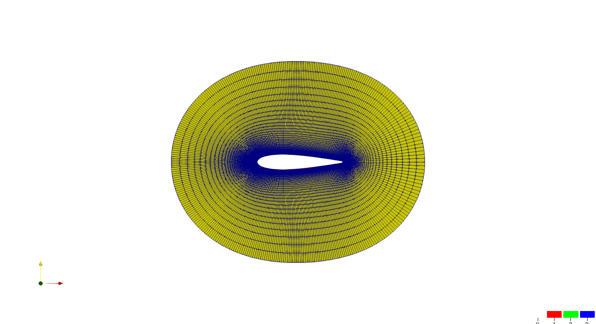
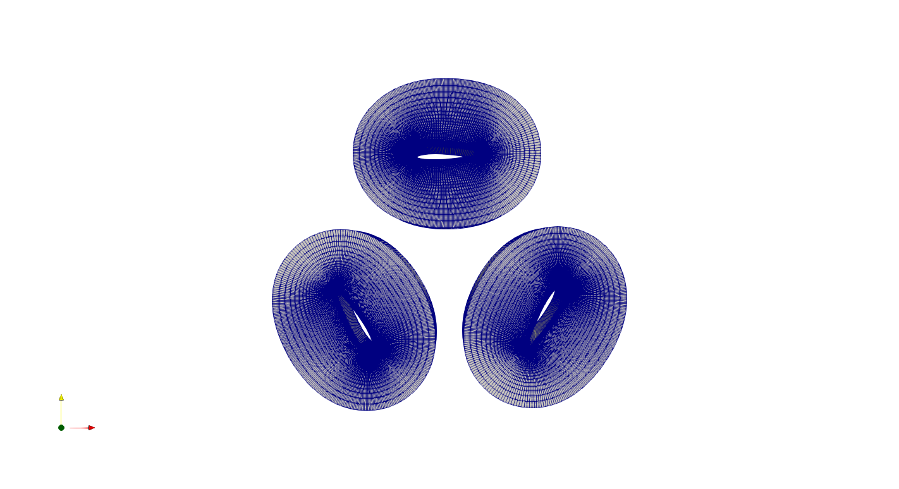
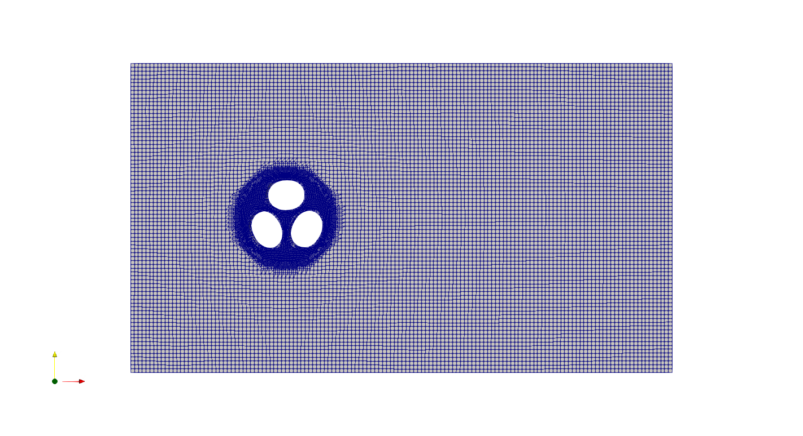
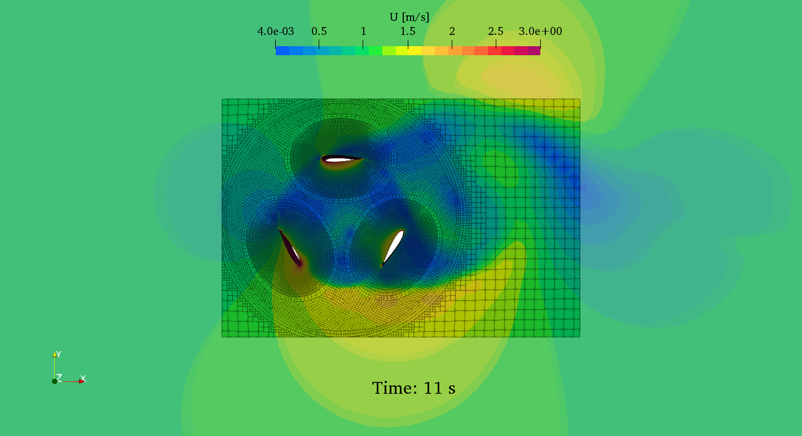

# OpenFOAM Example: Importing pyHyp Grid for Wind Turbine Simulation

This Git repository serves as a OpenFOAM example demonstrating the import of grid data from [pyHyp](https://github.com/mdolab/pyhyp) for wind turbine simulation purposes.
The repository showcases a user-friendly bash script that efficiently converts a pyHyp grid, specifically designed for an airfoil, 
into a fully structured wind turbine computational domain with a rotating region.

# Steps
- initial grid generated in pyHyp
  

The output grid format is in **.cgns**, which can be converted into an OpenFOAM polyMesh using the method available at [this GitHub repository](https://github.com/wyldckat/cgnsToFromFoam).

The remaining steps can be easily managed using the provided bash script **Allrun** for OpenFOAM-9. Here's a general outline of the process:

- rotate and replicate grid region around airfoils
  

- create srounding region with blockMesh/snappyHexMesh
  

- run the simulation with pimpleFoam (previously aka:pimpleDyMFoam) (Click picture below to Watch)
  
  
